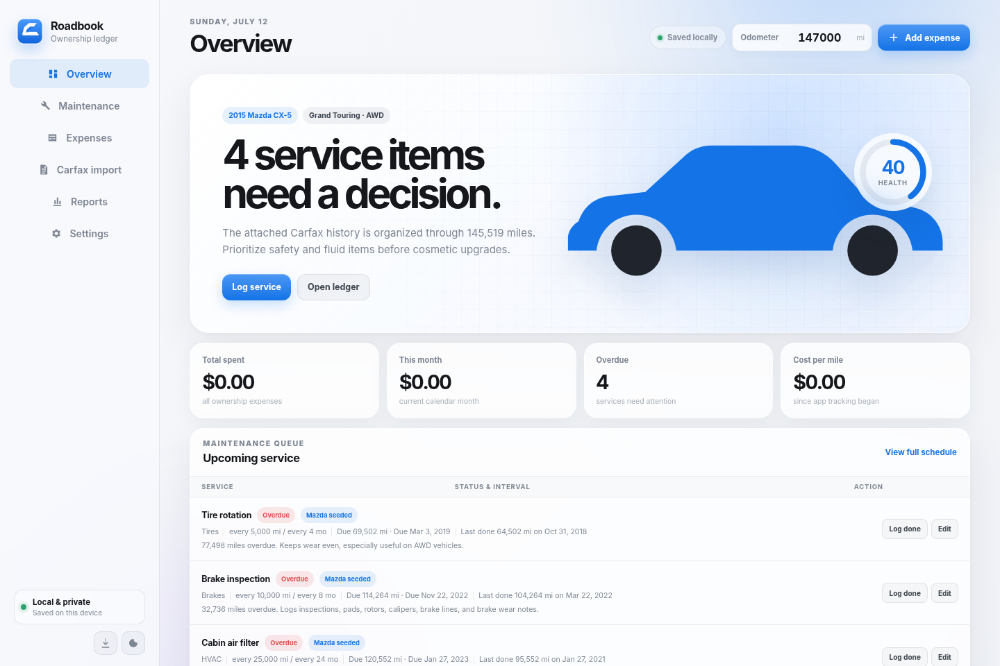

# Roadbook

**A calm, private home for your vehicle’s maintenance history and ownership costs.**

[](https://github.com/pasttrunks/roadbook/releases/latest/download/Roadbook.exe)

> No account. No subscription. No cloud database. Your vehicle data stays on your computer.



## What Roadbook does

Roadbook turns scattered vehicle paperwork into a useful ownership record. Add any vehicle, import a Carfax report or service log, review the matches, and see what needs attention next.

- Guided setup for any year, make, model, trim, drivetrain, and odometer.
- Import from text-based Carfax PDFs, TXT files, CSV files, or pasted history.
- Review every detected record before it is saved.
- Track maintenance, repairs, fuel, parts, insurance, and other expenses.
- Log gallons and full fill-ups to calculate real-world fuel economy.
- See upcoming service, overdue items, spending trends, and cost per mile.
- Search, edit, or remove imported and manually entered service records.
- Export JSON backups, expense CSVs, or a complete shareable vehicle history.
- Keep an optional VIN or chassis number of any length, including classic vehicles.
- Build a private market-value snapshot from comparable listings and track depreciation from the purchase price.
- Decode modern VINs with NHTSA and open matching public Visor market research without a paid valuation API.
- Light and dark themes with a responsive desktop interface.
- Local-only storage by default.

## Download and run on Windows

1. [Download the latest **Roadbook.exe**](https://github.com/pasttrunks/roadbook/releases/latest/download/Roadbook.exe).
2. Put it anywhere convenient, such as a `Roadbook` folder on your Desktop.
3. Double-click `Roadbook.exe`.

Roadbook is a single-file app; there is no `_internal` folder to keep beside it. Windows may show a SmartScreen notice because this community build is not code-signed; choose **More info → Run anyway** only when you downloaded it from this repository.

The release includes a .NET runtime configuration so Roadbook can load its own bundled WebView libraries even when Windows preserves an internet-origin mark on files extracted from the ZIP.

Roadbook uses Microsoft Edge WebView2, which is included with current Windows 10 and Windows 11 installations.

## First launch

Roadbook asks for the vehicle basics and then offers three clear paths:

1. **Import my records** — upload or paste an existing service history.
2. **Start fresh** — begin with an empty ledger.
3. **Explore demo** — try the app with sample Mazda CX-5 history.

The maintenance intervals included with Roadbook are editable starting points, not manufacturer-specific advice. Verify them against your owner’s manual.

## Importing history

Open **Import records**, choose a file or paste service text, and select **Find service records**. Roadbook recognizes common work such as oil changes, tire rotations, brakes, filters, coolant, batteries, belts, suspension, and drivetrain fluids.

Nothing is imported automatically. Confirm the dates, mileage, and detected service items before selecting **Import selected**.

PDF extraction works directly in the Windows app. In a browser preview, PDF extraction may require internet access to load PDF.js; TXT, CSV, and pasted text work without it.

## Privacy and backups

The Windows app stores the primary ledger at `%APPDATA%\Roadbook\roadbook-data.json` and keeps the ten most recent recovery copies under `%APPDATA%\Roadbook\recovery`. Browser storage remains as a compatibility copy for older installations. Roadbook does not include analytics, advertising, accounts, or a remote database.

Formatting or losing the computer also removes local `%APPDATA%` files. In **Reports → Where your data lives**, choose a OneDrive, Dropbox, network, USB, or other external folder to maintain `Roadbook-auto-backup.json` automatically. You can also use **Export backup** for a portable JSON copy that restores the complete ledger on another computer.

## Updates

The packaged Windows app checks the public GitHub Releases API when it starts. When a newer release exists, Roadbook shows the version and release notes before asking permission to download it. Update archives must come from this repository and must match GitHub's published SHA-256 digest before Roadbook installs them.

Versions older than 1.1.0 do not contain the updater and require one final manual download. Once 1.1.0 or newer is installed, later releases can be downloaded and installed from inside Roadbook.

Roadbook intentionally avoids accounts, advertising, market-value estimates, repair-shop booking, and opaque vehicle “health” scores. It records the facts you enter and keeps maintenance intervals editable instead of pretending to diagnose the vehicle.

## Run from source

Requirements: Windows and Python 3.11 or newer.

```text
setup_windows.bat
```

Later launches:

```text
run_windows.bat
```

Browser preview:

```text
python start_server.py
```

Then open `http://127.0.0.1:8765/index.html`.

## Build the Windows app

After running setup once:

```text
build_windows.bat
```

The packaged application is created at `dist\Roadbook.exe`. GitHub Actions runs the same packaging process, launch-tests the packaged interface, and publishes the single EXE for version tags. A compatibility ZIP is also published so Roadbook 1.1.0 can perform its first automatic update.

## Project structure

| File | Purpose |
| --- | --- |
| `index.html` | Application layout and accessible UI |
| `styles.css` | Responsive light/dark visual system |
| `app.js` | Ledger, schedules, imports, charts, and local storage |
| `desktop_app.py` | Windows WebView2 shell and local file APIs |
| `roadbook_core.py` | Durable storage, backup mirroring, and verified updates |
| `Roadbook.exe.config` | Trust configuration for bundled .NET WebView libraries |
| `RELEASE_NOTES.md` | User-facing overview shown for the current release |
| `start_server.py` | Lightweight browser-preview server |
| `build_windows.bat` | Local PyInstaller build |

## Important note

Roadbook helps organize records and reminders. It does not diagnose mechanical problems or replace the maintenance schedule, safety guidance, or service advice supplied by a vehicle manufacturer or qualified technician.
